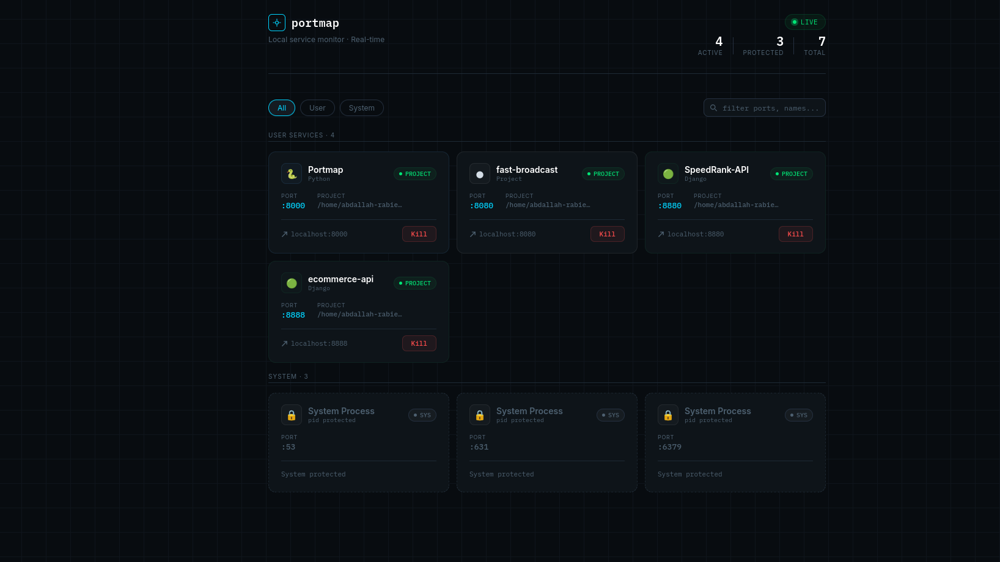
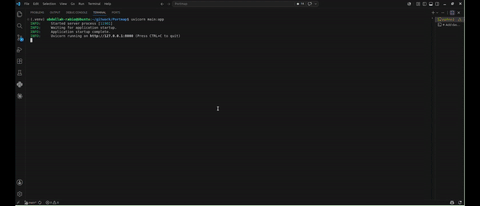

# Portmap

A real-time dashboard for the listening ports on your machine. Portmap shows
*what* is listening on every port, identifies the **project or service** behind
each one, and lets you terminate a process with a single click.




---

## Overview

*"What is running on port 3000 — and why won't it die?"* Every developer hits
this eventually. On a busy machine, dozens of dev servers, watchers, and
forgotten daemons compete for ports, and tracking down which one belongs to
which project — then stopping it safely — usually means a chain of `lsof`,
`grep`, and `kill`.

Portmap turns that into a glance. It keeps a live, categorized view of every
listening port — which project or service owns it, and whether it is safe to
kill — and lets you stop a process with one click, right from the browser.

Under the hood it is a lightweight, local, single-user tool: a FastAPI backend
plus a single static HTML page. No database, no build step.

---

## Why Portmap?

`lsof`, `ss`, and `netstat` already list open ports — but they stop at the PID.
Portmap is built for the step after that: understanding and acting on what you
find.

- **Answers "whose port is this?", not just "what PID?"** — each port is traced
  to a git project and framework, instead of leaving you to map PIDs by hand.
- **Live, not a one-off snapshot.** The view updates as servers start and stop,
  so you don't re-run a command and re-read its output every time.
- **Kill from the same place.** No copying a PID into a separate `kill` command —
  and system-owned processes are guarded against accidental termination.
- **Less noise.** IDE helpers and Chromium/Electron subprocesses are filtered
  out, so you see services rather than internals.

If you just need a one-off list, `ss -ltnp` is perfect. Portmap is for when you
are juggling many services and want to watch and manage them continuously.

---

## Quick Start

Linux with Python 3.11+:

```bash
pip install portmap-dev
portmap
```

Then open <http://127.0.0.1:7474>. See [Installation](#installation) and
[Usage](#usage) for details.

---

## Features

- **Live updates** — ports are rescanned every 0.5s and pushed to the browser
  over a websocket; the UI updates only when something actually changes.
- **Smart identification** — each listening port is categorized as:
  - **Project** — traced to a git repository, with framework detection
    (Django, Node.js, Go, Rust, Ruby, Java, PHP, …).
  - **Infrastructure** — known daemons like Redis, PostgreSQL, MySQL, MongoDB,
    Nginx, Docker.
  - **System** — kernel/system sockets with no owning PID.
  - **Unknown** — an honest fallback showing the raw process name.
- **Noise filtering** — IDE helpers (VS Code, Cursor, JetBrains, …) and
  Chromium/Electron internal processes are skipped.
- **One-click kill** — `SIGTERM` first, escalating to `SIGKILL` if the process
  doesn't exit within the grace period.
- **Safety guard** — processes owned by privileged/system accounts (UID < 1000)
  are protected and cannot be killed from the UI.
- **Non-blocking scanner** — scanning runs in a background thread, so the event
  loop stays responsive for websocket updates and kill requests.

---

## Installation

**Requirements:** Linux, Python 3.11+.

Install from PyPI:

```bash
pip install portmap-dev
```

This installs the `portmap` command. To keep it isolated from your other
tools, [`pipx`](https://pipx.pypa.io) is recommended:

```bash
pipx install portmap-dev
```

### From source

```bash
git clone https://github.com/abdallah-9a/Portmap.git
cd Portmap
python3 -m venv .venv && source .venv/bin/activate
pip install -e .
```

---

## Usage

Start the dashboard:

```bash
portmap
```

By default it binds to `127.0.0.1:7474` — a deliberately uncommon port, so it
does not collide with whatever dev server you are trying to inspect. Override
the host or port with flags:

```bash
portmap --port 9000        # run on a different port
portmap --host 0.0.0.0     # bind to all interfaces (see the security note below)
portmap --version          # print the installed version
```

You can also run it as a module:

```bash
python -m portmap
```

Then open the UI in your browser (default):

```
http://127.0.0.1:7474
```

Use the search box to filter by port or name, and click **Kill** next to a
process to terminate it.

> **Note:** `psutil` may need elevated privileges to see the owning PID of every
> socket. If some ports show up as "System" or with missing details, try running
> with `sudo` (be aware this also lets the kill endpoint act with root
> privileges).

---

## Screenshots & Demo

The hero screenshot sits at the top of this README — the first thing a visitor
sees. This section is for the moving picture:



_A short capture of the live updates and one-click kill in action._

---

## Limitations

- **Linux only.** Portmap relies on Linux semantics: `/proc`-based working
  directory lookup for git detection, real UID ownership checks, and the
  `UID < 1000` system-account protection. It is untested on macOS/Windows.
- **No authentication.** Anyone who can reach the server can kill processes.
  Bind it to `127.0.0.1` (the default) and do **not** expose it to a network.
- **Single user / local use.** It is designed as a personal dev tool, not a
  multi-tenant service.
- **Privilege-dependent visibility.** Without elevated privileges, some sockets'
  PIDs and metadata may be hidden by the OS.
- **Git-root heuristic.** Project detection assumes a process's working
  directory lives inside its repository; processes started elsewhere may fall
  back to "Unknown".

---

## Contributing

Issues and pull requests are welcome. For anything beyond a small fix, please
open an issue first to discuss the approach. For local development, install in
editable mode (`pip install -e .`) and run `fastapi dev src/portmap/main.py` to
get auto-reload.

---

## License

Released under the [MIT License](LICENSE).
